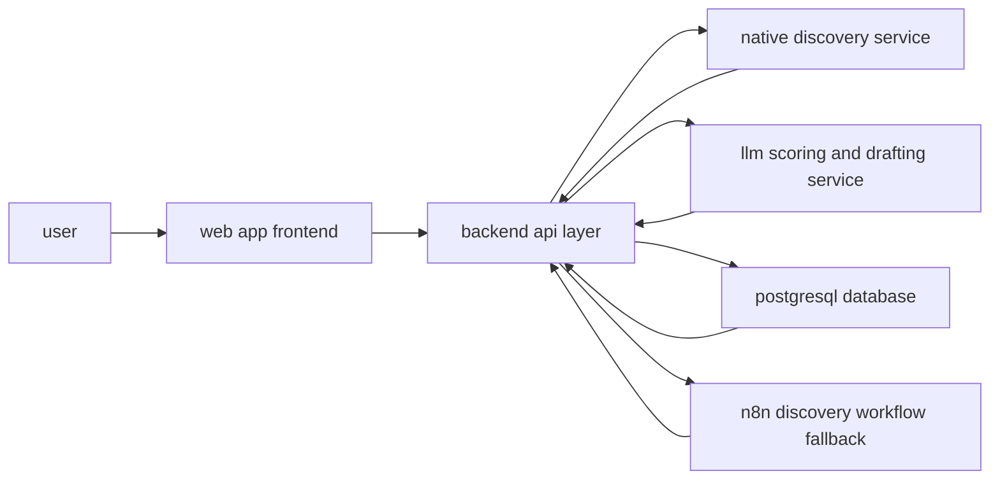
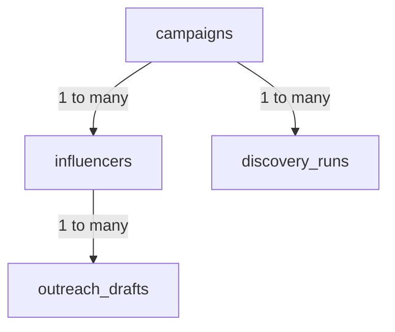
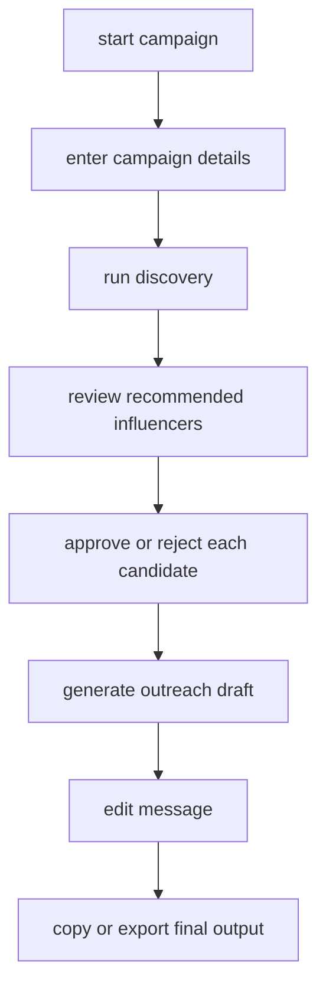

# OpenPaws RDP description

## 2-minute evaluator view

| day | priority | objective | decision gate | deliverable |
|---|---|---|---|---|
| day 1 | important | absorb the brief, define user and impact, validate assumptions | problem and user are clear | brief understanding note + assumption log + question list |
| day 2 | somewhat important | explore solution space and pick primary path with backup | mentor sign-off for approach | one-page project discovery note |
| day 3 | most important | lock system design, data model, api contract, explainability model | architecture is coherent and buildable | architecture, schema, integration plan, scoring model |
| day 4 | not that important but still | map user flow and break work into execution tasks | stage 3 plan is actionable | prioritized task plan with critical path |

## project context

### problem statement
animal advocacy teams often struggle to reach people outside their existing supporter circle. finding credible mainstream influencers with aligned values is slow, manual, and risky.

### primary user
campaign lead or outreach strategist at an animal advocacy organization.

### real-world impact
if this system helps teams find credible allies faster, campaigns can reach broader audiences through trusted voices and improve animal welfare outcomes.

### done definition
an evaluator should be able to verify that:
- the user can define a campaign
- the system can return candidate influencers
- each recommendation has transparent scoring and rationale
- a human can approve or reject each candidate
- the system can generate editable outreach drafts

## stage 1 - discovery

### Day 1 - absorb the brief 

#### outputs required
| output | description | status rule |
|---|---|---|
| problem and user statement | one paragraph in plain language | must name who the user is |
| assumption register | technical, data, legal, and workflow assumptions | each assumption tagged as verifiable or open |
| advocacy impact sentence | one line that connects product success to animal impact | must be specific and testable |
| question list | blockers and clarification questions | must be ready before end-of-day check-in |

#### assumption register
| id | assumption | verifiable now | action |
|---|---|---|---|
| a1 | existing n8n discovery workflow is usable through webhook | yes | test with sample payload |
| a2 | social data access can be done legally and within platform terms | partially | confirm data source policy |
| a3 | llm reasoning can produce usable alignment rationale | yes | run prompt quality tests |
| a4 | users will review and edit drafts instead of trusting automation blindly | no | confirm through pilot feedback |
| a5 | v1 can run without authentication | no | confirm with stakeholders |

#### day 1 guiding questions
1. what exactly is the acceptance criteria for done?
2. who signs off completion?
3. what is the smallest useful version?
4. which social platforms are first priority?
5. do we need data persistence across sessions?
6. is this internal-only or public-facing?

### Day 2 - explore the solution space (somewhat important)

#### research snapshot
| reference | what it does well | where it falls short for this project |
|---|---|---|
| influencex | full discovery-to-outreach pipeline and self-hosting | optimized for commercial marketing, weak value alignment logic |
| apify brand safety tooling | structured risk signals and explainable scoring | risk-centric, not advocacy alignment-centric |
| creatorgraph-style matching systems | deterministic compatibility dimensions | focused on brand partnerships, not mission advocacy |
| nonprofit influencer saas tools | practical filters and campaign workflows | closed platform and limited transparency |
| trust and authenticity scoring projects | clear scoring breakdown and review workflow | detects bad actors, does not discover aligned allies |

#### approach comparison
| approach | summary | strengths | risks |
|---|---|---|---|
| a - thin wrapper | frontend over existing n8n flow | fastest to launch | low control and hard to evolve |
| b - native rebuild | implement discovery and scoring fully in app backend | full control and stronger ux | longer build and higher initial effort |
| c - hybrid | n8n discovery plus native scoring and outreach | balanced speed and flexibility | integration complexity |

#### approach c hybrid n8n for discovery native for everything else
use the n8n workflow as the initial discovery engine triggered via webhook, while native backend services handle scoring, enrichment, explainability, and outreach generation. the frontend owns the full user experience.

pros:
- best balance of speed and flexibility
- reuses proven discovery logic
- gradual migration path away from n8n when native discovery is stable

cons:
- two systems to maintain
- higher integration complexity
- requires a clean handoff between n8n output and native processing

technical problems:
- data format normalization between n8n and backend
- boundary error handling
- async coordination for discovery status and retries

#### selected direction
primary: approach c (hybrid)
fallback: approach a (thin wrapper using n8n workflow)

reasoning: hybrid gives fast delivery by reusing current discovery while preserving control over explainability, scoring transparency, and user review workflows, while the thin wrapper path remains a safe fallback.

#### dependency checklist
| dependency | type | risk | action |
|---|---|---|---|
| n8n workflow access | internal | high | request access immediately |
| llm api key and budget | external api | medium | confirm model and budget limits |
| hosting target | infra | medium | decide early to avoid rework |
| database service | infra | low | provision postgresql early |
| optional social enrichment api | external api | medium | defer to post-mvp unless required |

#### openpaws hugging face model research
| need | model | fit |
|---|---|---|
| support for animal advocacy detection | `open-paws/animal_alignment_prediction_shortform` | strong for ranking text by advocacy alignment |
| support for advocacy preference scoring | `open-paws/animal_advocate_preference_prediction_longform` | useful for longer text messaging evaluation |
| relevance to animal issues | `open-paws/relevance_to_animal_issues_prediction_shortform` | useful for filtering off-topic creators and content |
| predicted impact on animals | `open-paws/effect_on_animals_prediction_shortform` | useful for prioritizing higher welfare impact messaging |

current gap:
- openpaws models are mainly text ranking and preference prediction models
- no explicit openpaws model is listed as a dedicated animal violence detector
- use a two-stage pipeline: stage 1 safety or violence classifier, stage 2 openpaws advocacy-alignment scoring

## stage 2 - design and architecture

### Day 3 - system design (most important)

#### architecture diagram

#### data model diagram

#### core schema fields
| entity | key fields |
|---|---|
| campaigns | id, org_name, campaign_goal, target_audience, language, status |
| influencers | id, campaign_id, name, handle, alignment_score, credibility_score, status, evidence_json |
| outreach_drafts | id, influencer_id, subject_line, message_body, is_edited |
| discovery_runs | id, campaign_id, status, external_run_id, result_count |

#### tech stack decisions
| layer | selected option | why this fits |
|---|---|---|
| frontend and backend | next.js with typescript | single stack, fast iteration, clear api integration |
| database | postgresql | strong relational model for campaign to influencer workflows |
| orm | drizzle | typed schema and clean migrations |
| llm integration | provider abstraction with primary and fallback model | resilience and cost control |
| deployment | vercel or equivalent serverless target | low ops overhead for early stages |

#### api contract summary
| endpoint | method | purpose |
|---|---|---|
| `/api/campaigns` | post | create campaign |
| `/api/campaigns/:id/discover` | post | trigger discovery run |
| `/api/campaigns/:id` | get | campaign plus influencer list |
| `/api/influencers/:id` | patch | update decision and notes |
| `/api/influencers/:id/outreach` | post | generate outreach draft |
| `/api/outreach/:id` | patch | edit outreach draft |

#### explainability and trust model
| dimension | weight | evaluation rule |
|---|---|---|
| values alignment | 35% | mission fit signals in content and behavior |
| audience relevance | 25% | overlap with target audience and campaign context |
| credibility and trust | 25% | authenticity, reputation, consistency |
| reachability | 15% | practical chance of contact and collaboration |

design rule: every score must include rationale text and cited evidence, plus visible uncertainty notes.

### Day 4 - flow design and planning (not that important but still)

#### user flow

#### execution task plan
| order | task | estimate | critical path |
|---|---|---|---|
| 1 | bootstrap app shell and database schema | 4h | yes |
| 2 | implement campaign create and read apis | 3h | yes |
| 3 | connect n8n discovery trigger and status tracking | 5h | yes |
| 4 | store and render influencer results with scoring panels | 6h | yes |
| 5 | add approve/reject workflow with notes | 3h | yes |
| 6 | add outreach generation and edit flow | 5h | yes |
| 7 | polish filters, sorting, and error handling | 4h | no |
| 8 | add telemetry and basic docs | 2h | no |

#### build order decision
start with backend integration and data persistence first because it de-risks discovery quality and end-to-end viability before ui polish.

## risks and controls
| risk | impact | likelihood | mitigation |
|---|---|---|---|
| poor discovery quality from upstream workflow | high | medium | run early quality benchmarks and keep backup approach |
| hallucinated rationale from llm | high | medium | require evidence fields and confidence flags |
| timeout or unstable webhook execution | medium | medium | async run tracking, retries, and clear failure states |
| cost drift from llm usage | medium | medium | token budget caps and model fallback strategy |
| weak user trust in recommendations | high | medium | transparent scoring breakdown and manual override |

## sign-off checklist
| checkpoint | owner | pass condition |
|---|---|---|
| day 1 review | mentor | problem, user, assumptions, and question list are complete |
| day 2 review | mentor | primary plus backup approach accepted |
| day 3 review | mentor and technical lead | architecture, schema, and api plan are coherent |
| day 4 review | mentor | task plan is prioritized and executable |

this readme is now structured for quick evaluation and direct execution.
